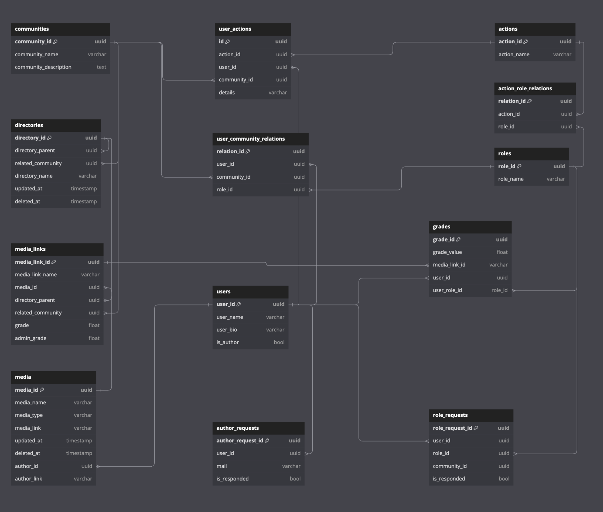

# Storage for Dream Powered Media

Это хранилище медиа сервиса с внутренней оценкой контента Dream Powered Media.
В качестве основной модели хранилища выбрана реляционная модель под управлением СУБД Postgresql.
Сейчас база данных полностью представлена в реляционном виде, но работы по внедрению MongoDB уже начаты.


### Схема




### Структура

```shell
├── README.md
├── mongodb
│   ├── Dockerfile
│   ├── data
│   │   ├── schema_A.json
│   │   └── schema_B.json
│   ├── start.sh
│   └── stop.sh
└── postgresql
    ├── Dockerfile
    ├── assets
    │   ├── datagrip-connect.png
    │   └── schema.png
    ├── data
    │   ├── schema.sql
    │   └── schema.txt
    ├── run.sh
    └── stop.sh
```


### Технологии

- Docker
- Postgresql
- MongoDB


### Настройка и запуск

1) необходимо установить в вашей операционной системе Postgresql

2) необходимо установить в вашей операционной системе Docker

3) необходимо запустить Docker командой из терминала или установить и запустить Docker desktop

4) далее можно поднять базу данных, используя приложенный файл скрипта (демонстрационный вариант)

    ```shell
    ./postgresql/run.sh
    ```


### Работать с базой можно из dbeaver или datagrip

Прилагаю данные для подключения к базе с моей демо-конфигурацией в datagrip


### Безопасность

- Важно учитывать, что пароль от базы, а также все данные конфигурации базы лучше хранить в файлах окружения.

- Для хранения данных жизненного цикла базы, а также для создания дампов и бэкапов необходимо использовать защищенные volume, а также подключаться по защищенному соединению к хосту, где будет запускаться СУБД 


### Развитие

- заранее думая о развитии и будущих оптимизациях вложенной структуры сообществ
   я попробовал сделать варианты хранения в mongo и приложил тестовые структуры.
- также я начал размечать хранилище кэша с помощью redis
- важно сказать, что с точки зрения оптимизации хранилища через документо-ориентированную СУБД, необходимо выдержать размеры хранимых сущностей
- с ростом нагрузки необходимо постараться выбрать оптимальную механику жизненного цикла кэша redis, под которую подобрать максимально эффективный период инвалидации


### Дополнительно

- ссылка на диаграмму https://dbdiagram.io/d/DreamPoweredMedia-6640fe229e85a46d55a21d05

- дополнительно указал схему реляционной БД в директории `postgresql/data`. Ее можно использовать при необходимости совершить миграцию вручную. 


### Ссылки

- базовый образ постгреса: https://hub.docker.com/_/postgres

- базовый образ монго: https://hub.docker.com/_/mongo

- работа с докером: https://www.docker.com/get-started/

- документация постгрес: https://www.postgresql.org/docs/

- документация монго: https://www.mongodb.com/docs/
